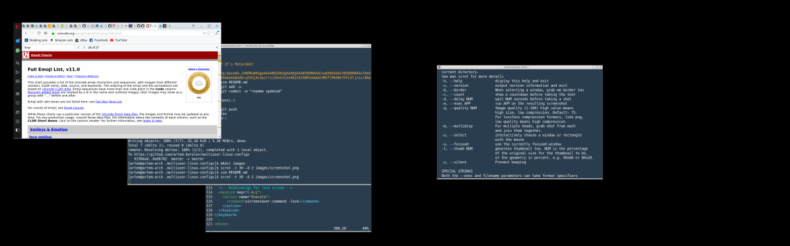

# multiuser-linux-config

Collection of configurations for programs that I use.
Idea is to have it in repo, so when I install linux on another machine I can
confugure it sipmly by fetching this repo and running one command.
Another cool thing: when I change config on one machine - I can push my changes to
repo and apply this change on all other machines that I use simply by pulling chages
from this repo.

I use Arch Linux (it can be Debian if you don't like Arch, but nothing else, or you're wasted).
I use Openbox running directly from .bash_profile. No any fancy desktop environments,
no fancy login managers. Login from console, it starts X session with openbox.
You can login with multiply user at the same time in first 5 ttys (CTRL+ALT+[1-5])

93MB in cold start. Always hardcore, Linux Forever!

## Table of Contents

<!-- vim-markdown-toc GFM -->

* [Prerequisites](#prerequisites)
	* [Arch](#arch)
	* [Debian](#debian)
	* [Facebook Messenger](#facebook-messenger)
* [Usage](#usage)
* [Restore original configs](#restore-original-configs)
* [Tips](#tips)
	* [custom .bashrc](#custom-bashrc)
	* [Language switching](#language-switching)
	* [VirtualBox additions](#virtualbox-additions)
* [Screenshots](#screenshots)

<!-- vim-markdown-toc -->

## Prerequisites

Install Arch Linux base (+base-devel if you need it). Or install Debian base system without GUI.
Next install software required to run desktop in minimal mode:

### Arch

```bash
root@machine# pacman -S gmrun xterm openbox xorg-xinit git vim opera xscreensaver dhclient xorg-setxkbmap
```

### Debian

```bash
root@machine# apt install gmrun xterm openbox xorg-xinit git vim firefox xscreensaver xorg-setxkbmap
```

You can download Opera browser from their website. They have official Debian package.
I prefere Opera, cause they created browser for linux, which does not require tuning.
Firefox on another side already for 10 years cannot remove unnecessary window header.
Anyways check out Opera - it have Facebook Messanger in left side

### Facebook Messenger

Don't use it please. Use IRC (HexChat) or something like that. It exists for 31 year.
Wtf are you using Facebook??? It's Retarded. Don't use it please.

## Usage

```bash
$ cd ~/
$ git clone https://github.com/artem-korolev/multiuser-linux-configs.git .multiuser-linux-configs
```

This will clone this repo into your ~/ home directory under ".multiuser-linux-configs" name.
So it will be hidden

```bash
$ bash .multiuser-linux-configs/bin/check.sh
```

It will show you list of configs that exists in your system, but not linked to repo.
If result is empty, then all configs are linked, or maybe corresponding applications
are not installed, or do not have user configs yet

```bash
$ bash .multiuser-linux-configs/bin/check.sh --fix
```

This will backup not linked configs inside ~/.configs.bak directory, so you always can restore it
and after that it will link repo configs into your user directory

## Restore original configs

```bash
$ mv ~/.configs.bak/* ~/
```

## Tips

### custom .bashrc

Sometimes you want to have very custom configuration (like proxy settings and so on),
which you don't want to share with all of your mashines.
You can do it in $HOME/.bashrc_local.
Its loaded automatically with .bashrc (there is instruction for it - check it out)

### Language switching
There is no need to install language switchers. Better run this command:

```bash
setxkbmap -model pc104 -layout us,ru -option grp:win_space_toggle
```
you can add it to your .xinitrc to automate it (I will do it tomorrow here)

### VirtualBox additions

In Arch linux:

```bash
pacman -S virtualbox-guest-utils
```

Do not enable services with systemctl. It's Retarded. Whenever you need it:

```bash
VBoxClient --display
or
VBoxClient --clipboard
...
VBoxClient --help
;)
```

Wtf you need any service if you don't use it? It's Retarded! :D

## Screenshots



🤘💪🤣😍😍
