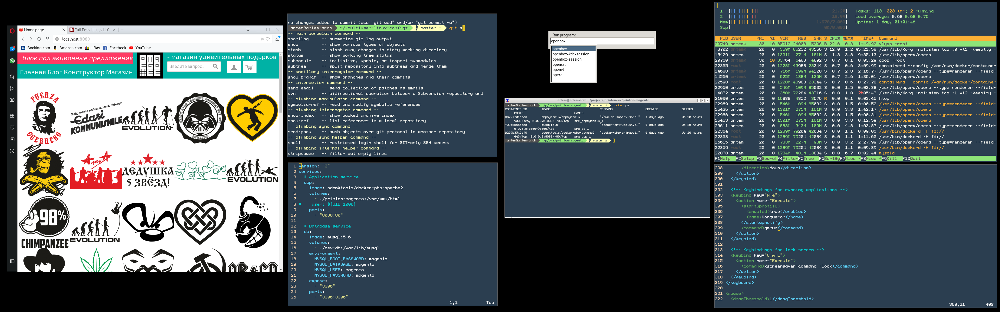

# multiuser-linux-config

Collection of configurations for programs that I use.
Idea is to have it in repo, so when I install Solaris on another machine I can
confugure it sipmly by fetching this repo and running one command.
Another cool thing: when I change config on one machine - I can push my changes to
repo and apply this change on all other machines that I use simply by pulling chages
from this repo.

I use Solaris (it can be Linux as well - switch to master branch for that).
I use Openbox running directly from .bash_profile. No any fancy desktop environments,
no fancy login managers. Login from console, it starts X session with openbox.
You can login with multiply user at the same time in first 5 ttys (CTRL+ALT+[1-5])

## Table of Contents

<!-- vim-markdown-toc GFM -->

* [Prerequisites](#prerequisites)
	* [Arch](#arch)
	* [Debian](#debian)
	* [Facebook Messenger](#facebook-messenger)
* [Usage](#usage)
* [Restore original configs](#restore-original-configs)
* [Tips](#tips)
	* [custom .bashrc](#custom-bashrc)
	* [Language switching](#language-switching)
	* [VirtualBox additions](#virtualbox-additions)
* [Screenshots](#screenshots)

<!-- vim-markdown-toc -->


## Usage

```bash
$ cd <some-project-directory or home>
$ git clone https://github.com/artem-korolev/multiuser-linux-configs.git
$ cd multiuser-linux-configs
$ ./run.sh
```

## Tips

### custom .bashrc

Sometimes you want to have very custom configuration (like proxy settings and so on),
which you don't want to share with all of your mashines.
You can do it in $HOME/.bashrc_local.
Its loaded automatically with .bashrc (there is instruction for it - check it out)

### Language switching
There is no need to install language switchers. Better run this command:

```bash
setxkbmap -model pc104 -layout us,ru -option grp:win_space_toggle
```
you can add it to your .xinitrc to automate it (I will do it tomorrow here)

## Screenshots



🤘💪🤣😍❤
